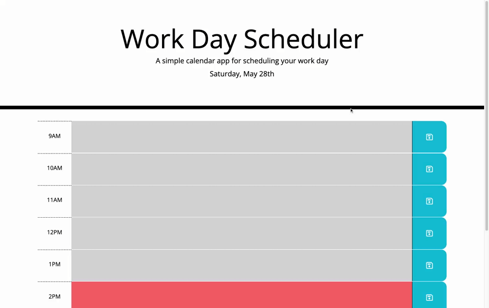

# 05 Third-Party APIs: Work Day Scheduler

## Goal

Given a starter code file of an html page and css style sheet, the goal of this assignment was to create a work day scheduler, in which the user is able to view and edit calendar items for each hour of a standard work day (9am-5pm). The javascript functionality is written using Jquery and Moment.js libraries, and is responsive to the time of day (shows current date at the top of the screen, and also color codes the hour blocks based on the current time). The schedule data is saved to local storage, and user can save changes made to the calendar by clicking on the save icon on the right side of the page, which updates the respective hour's "schedule" field in local storage. The user is then able to close/refresh the page and return to the same inputted schedule details.

https://austibb.github.io/daily-planner-JS/

https://github.com/austibb/daily-planner-JS
